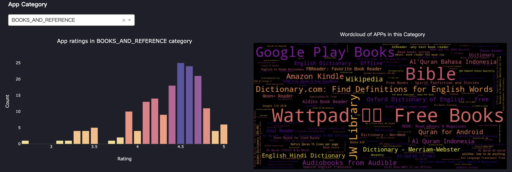
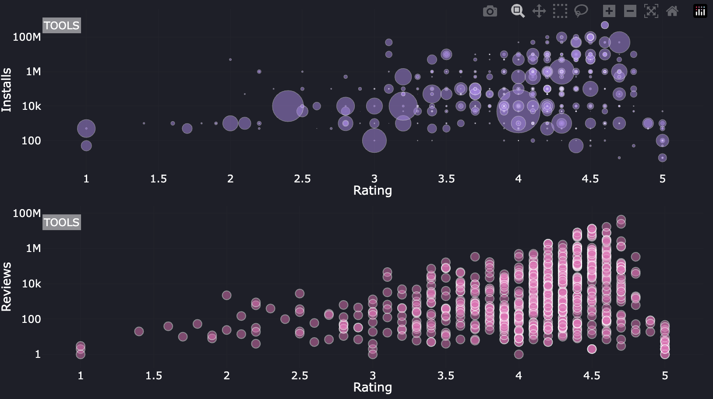
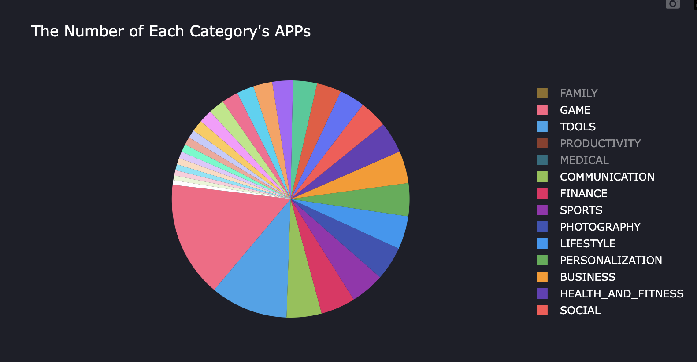
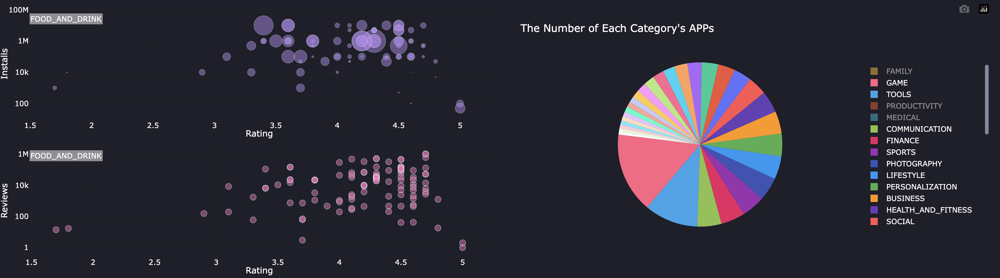

# README

| Name         | StudentID |
| ------------ | --------- |
| Daize Chu | 2051498   |

## 1. How to run

* **Packages needed to install:** dash , wordcloud , matplotlib , plotly , pandas , base64
* run the `myDashBoard.py`
* Visit http://127.0.0.1:8080/ to see the dashboard

## 2. Functions

### 2.1 'Analysis of a specific category of app"' - Bar Graph&wordcloud

* Clicking on the dropdown menu allows you to select the desired Category for analysis. Once selected, the bar chart will display the number of apps in each rating within that Category. The word cloud will show the names of these apps, where the size of the name corresponds to the number of installs, with larger names indicating higher download counts.



### 2.2 Scatter Graph

* The above scatter graph reflects the relationship between the number of installs and the Rating of an APP of a specific category.   
* The scatter graph below reflects the relationship between Reviews and the number of an APP of a specific category.
* By hovering on each point, it can show the detail information.
  



#### 2.3“The Number Of Each Category's APPs”-Pie Chart
* By hovering on each point, it can show the detail information.
* Furthermore, when you hover your mouse over different sectors, the adjacent scatter plot will display the relationship between Rating and installs, as well as the relationship between Rating and Reviews within the corresponding Category.






## 3. Project Structure

```
├── myDashBoard.py
└── googleplaystore.csv
```